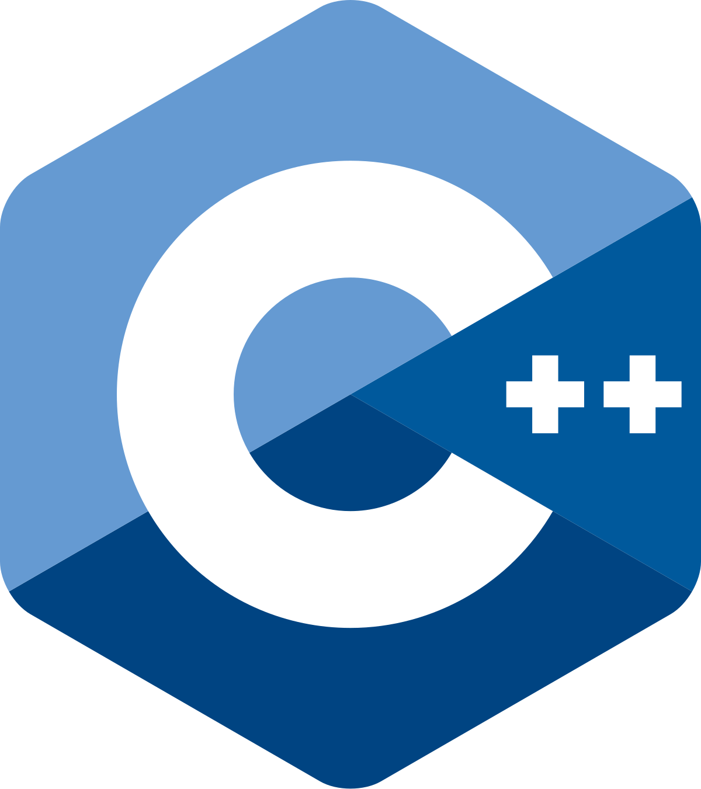
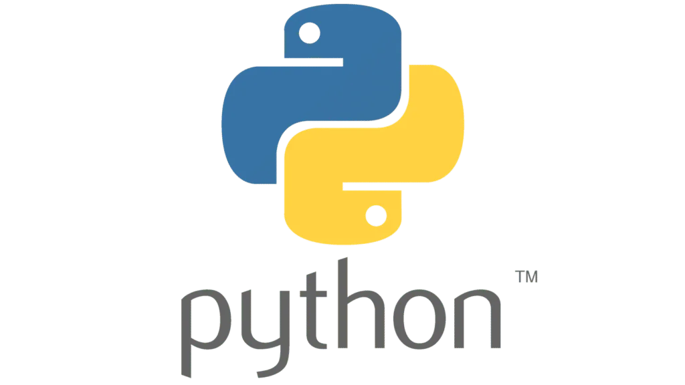
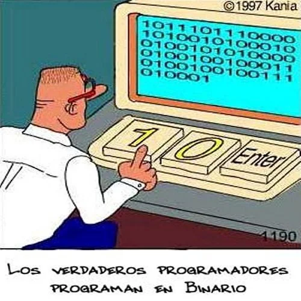
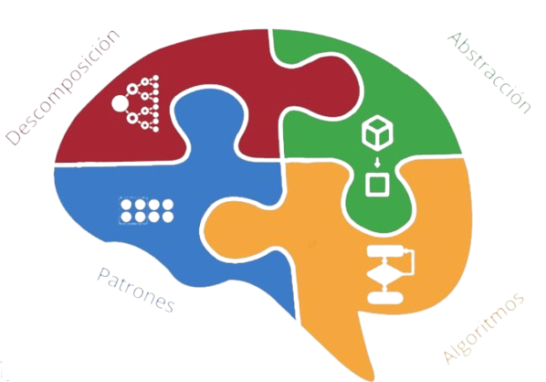
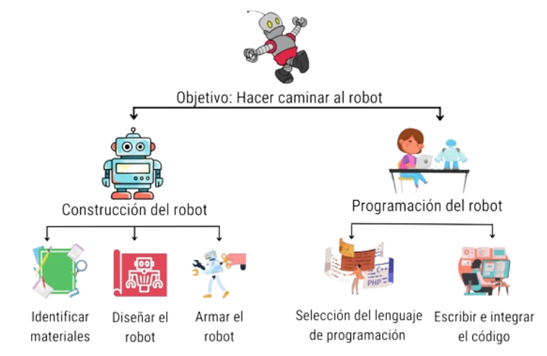
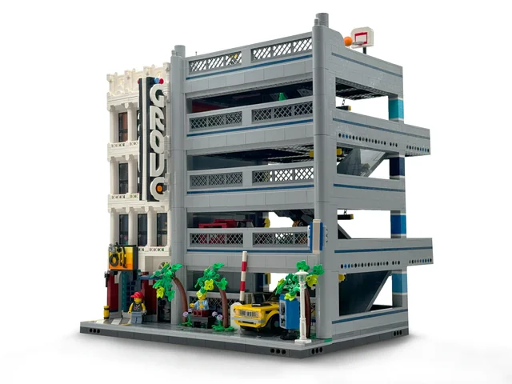
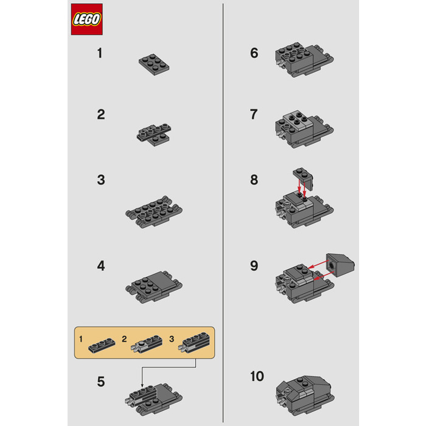
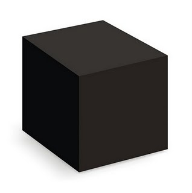

## 💡 Introducción

---

**Objetivos del curso**
Comprender los principios fundamentales del funcionamiento de las computadoras y los métodos de comunicación con estos sistemas. 🧠

---

**Importancia de la programación**
El dominio de la programación permite desarrollar habilidades de resolución de problemas y crear soluciones tecnológicas de impacto. ✨

---

## 🔢 Conceptos Fundamentales

---

**Definición de Algoritmo**
Un algoritmo es una **secuencia finita y ordenada de pasos** o **instrucciones definidas** para resolver un problema o realizar una tarea específica.

---

**Algoritmo: Analogía con procesos cotidianos 🧑‍🍳**
Proceso de preparación de una torta:

1. Mezclar ingredientes según proporciones.
2. Hornear a temperatura específica.
3. Permitir enfriamiento controlado.
Cada paso constituye un elemento esencial del proceso.

---

**Definición de Software**
El software comprende las **instrucciones y datos** que especifican las operaciones que debe realizar una computadora.
Constituye el componente intangible del sistema computacional. 👻

---

**Software: Ejemplos de aplicación**

* Navegadores web 🌐
* Aplicaciones bancarias 💰
* Videojuegos 🎮

---

**Definición de Hardware**
El hardware constituye la **parte física y tangible** de una computadora o dispositivo electrónico: los **componentes materiales** como teclado, pantalla, disco duro y procesador.

---

**Hardware: Ejemplos de componentes**

* Teclado ⌨️
* Monitor 🖥️
* Disco duro 💽
* Memoria RAM 📀

---

**Definición de Programación**
La programación es el **proceso de crear instrucciones** (código) para que una computadora las ejecute de manera específica.
Constituye un método de comunicación con sistemas computacionales. 🗣️💻

---

**Definición de Lenguaje de Programación**
Un lenguaje de programación es un **conjunto de reglas y símbolos** utilizados para escribir instrucciones computacionales.
Funciona como un sistema de comunicación especializado para computadoras. 💬

---

**Python: Características principales 🐍**

* **Legibilidad:** Sintaxis similar al lenguaje natural.
* **Versatilidad:** Aplicable en desarrollo web, ciencia de datos, juegos y más.
* **Adopción industrial:** Utilizado por organizaciones como Google, Netflix y NASA.

---





---

**Código fuente**

```python
numero_secreto: int = 7
adivinado: bool = False

while not adivinado:
    try:
        intento_str = input('Adivina el número secreto (entre 1 y 10): ')
        intento_num = int(intento_str)
        if intento_num == numero_secreto:
            print('🎉 ¡Felicidades! ¡Adivinaste!')
            adivinado = True
        else:
            print('🤔 Intenta de nuevo.')
    except ValueError:
        print('Por favor, ingresa un número válido.')
```

---




---

**Proceso de construcción y ejecución de programas**
Secuencia que transforma una idea conceptual en una solución computacional ejecutable.

---

**Flujo de ejecución de programas ➡️**
Código fuente (Python) ✍️
⬇️
Intérprete de Python 🐍 (procesamiento)
⬇️
Sistema computacional 💻 (ejecución)
⬇️
Resultado obtenido ✅

---


## Bases 🧠



---

#### A. Descomposición ፨

**Dividir** problemas complejos en componentes más **pequeños** y manejables


---



---

La **descomposición** facilita el abordaje de problemas de gran complejidad mediante su fragmentación en elementos más simples.

---

#### B. Patrones 🚧

**Estructuras** o **modelos** que permiten identificar similitudes en datos o situaciones, facilitando la resolución eficiente de problemas.

---



<===>



---

**Aplicación práctica**

Los patrones constituyen soluciones **reutilizables** que funcionan como guías metodológicas.

Existen numerosos patrones documentados que contribuyen a desarrollar programas de mejor calidad en menor tiempo.

---

#### C. Abstracción 🔳

**Ocultar** la complejidad de implementación de un sistema. Se concentra en **qué** realiza un componente, no en **cómo** lo ejecuta.



---


vs.


---

La **abstracción** permite manejar la complejidad sin requerir conocimiento detallado de cada componente del sistema.


---

#### D. Algoritmos 🧮

Secuencia **finita** y **ordenada** de instrucciones o pasos **bien definidos**, para **resolver** un problema

---

## ♻️ Ciclo de Desarrollo de Software (SDLC)

---

**Metodología para el desarrollo de software de calidad**
Proceso estructurado y organizado para la creación de sistemas computacionales, comparable a la construcción arquitectónica. 🏗️

---

**Fase 1: Análisis 🔍**
**Identificación del problema a resolver**

* Determinar las **necesidades** del usuario.
* Establecer los **objetivos** del programa.
* Constituye la fase más crítica del proceso.

---

**Fase 2: Diseño ✏️**
**Planificación de la solución**

* Estructurar la **arquitectura** del programa.
* Definir los **algoritmos** necesarios.
* Crear el "plano" previo a la implementación.

---

**Fase 3: Implementación 💻**
**Desarrollo del código**

* Traducir el diseño a **código fuente**.
* Escribir las **instrucciones** en el lenguaje seleccionado.
* Materializar la solución planificada.

---

**Fase 4: Prueba ✅**
**Verificación del funcionamiento**

* Identificar **errores** (bugs) en el código.
* Confirmar el cumplimiento de todos los **requisitos**.
* Realizar ajustes hasta alcanzar la funcionalidad deseada. ✨

---

**SDLC: Síntesis del proceso**
Análisis ➡️ Diseño ➡️ Implementación ➡️ Prueba
(proceso iterativo para mejora continua) 🔄

---

## 🗺️ Pensamiento Computacional para Problemas

---

**Definición de Pensamiento Computacional**
Metodología de **resolución de problemas** que utiliza técnicas empleadas en ciencias de la computación.
Constituye una habilidad transversal aplicable en múltiples disciplinas. 🌟

---

**Paso 1: Comprensión del Problema 🤔**

* **Identificar los requerimientos**
* **Establecer el objetivo final**
* **Analizar la información disponible**
* **Determinar los resultados esperados**
Análisis preliminar antes de proceder a la solución.

---

**Paso 2: Descomposición del Problema 🧩**

* Dividir problemas complejos en **componentes manejables**.
* Resolver cada elemento de forma independiente.
* Aplicar estrategia modular de resolución.

---

**Paso 3: Especificación del Algoritmo 📝**

* Describir los **pasos detallados** para cada subproblema.
* Utilizar lenguaje natural, diagramas de flujo o pseudocódigo.
* Desarrollar la secuencia lógica previa a la codificación.

---

**Paso 4: Codificación ✍️**

* Traducir el algoritmo al **lenguaje de programación** seleccionado.
* Implementar las instrucciones de forma sistemática.
* Aplicar conocimientos de sintaxis y semántica del lenguaje.

---

**Paso 5: Validación (Prueba y Depuración) ✅**

* **Ejecutar** el código desarrollado.
* **Verificar** la corrección de los resultados.
* **Identificar y corregir** errores encontrados.
* Confirmar el funcionamiento según especificaciones.

---

**Metodología: Proceso integral**
Problema Complejo ➡️ Descomposición ➡️ Algoritmo Detallado ➡️ Implementación ➡️ Validación ✅

---

**Ejercicio 1: Aplicación del pensamiento computacional 🚶‍♀️**
**Enunciado:** Desarrollar un programa que solicite nombre y edad del usuario, y genere el mensaje "Hola [Nombre], tienes [Edad] años."
Aplicar los 5 pasos de la metodología de pensamiento computacional.

---

**Ejercicio 1: Desarrollo de la solución 💡**

* **Comprensión:** Requerir entrada de nombre y edad, generar saludo personalizado.
* **Descomposición:**
  * Solicitar nombre del usuario.
  * Solicitar edad del usuario.
  * Construir mensaje personalizado.
  * Mostrar mensaje resultante.

---

* **Especificación del Algoritmo:**
    1. Solicitar "¿Cuál es tu nombre?". Almacenar respuesta.
    2. Solicitar "¿Cuántos años tienes?". Almacenar respuesta.
    3. Concatenar elementos: "Hola", nombre, "tienes", edad, "años.".
    4. Mostrar mensaje resultante.
* **Codificación:** (Ver diapositiva siguiente)
* **Validación:** Ejecutar código, ingresar datos de prueba y verificar formato correcto del mensaje.

---

**Ejercicio 2: Implementación del código ✅**

```python
# Codificación
nombre = input("¿Cuál es tu nombre? ")
edad = input("¿Cuántos años tienes? ")
mensaje = "Hola " + nombre + ", tienes " + edad + " años."
print(mensaje)
```

---

## 🛠️ Entorno de Programación

---

**Definición de entorno de programación**
Espacio de trabajo especializado para el desarrollo y ejecución de código.
Constituye el conjunto de herramientas necesarias para la programación. 🖥️

---

**Componentes fundamentales:**

* **Editor de texto:** Herramienta para la escritura de código fuente.
* **Intérprete/Compilador:** Procesador que traduce código a lenguaje de máquina.
* **Consola/Terminal:** Interfaz para visualización de resultados del programa.

---

**IDEs (Entornos de Desarrollo Integrados)**
Aplicaciones que **integran** todas las herramientas de desarrollo en una sola plataforma.
Proporcionan un espacio de trabajo completo y unificado. 🚀

---

**Ejemplos de IDEs para Python:**

* **VS Code (Visual Studio Code):** Versatil, extensible, amplia adopción.
* **PyCharm:** Robusto para desarrollo profesional avanzado.
* **Jupyter Notebooks:** Especializado en análisis de datos y aprendizaje interactivo.

---

## ✍️ Instrucciones y Sus Tipos

---

**Definición de instrucción**
Unidad **básica y fundamental** de un programa computacional.
Constituye una orden específica dirigida al sistema computacional. 🗣️

---

**Tipos de instrucciones fundamentales:**

1. **Declaraciones**
2. **Asignaciones**
3. **Control de Flujo**
4. **Entrada y Salida (I/O)**

---

**Tipo 1: Declaraciones (Variables) 🏷️**

* Establecen **identificadores** para contenedores de información.
* Funcionan como etiquetas para espacios de memoria.
* `nombre_variable = valor_asignado`

---

**Ejemplo de declaración**

```python
saludo = "Hola"  # Declara 'saludo' y almacena el texto "Hola"
edad = 30        # Declara 'edad' y almacena el número 30
```

**`saludo` y `edad` constituyen variables.**

---

En lenguajes como C++, la declaración puede realizarse sin asignación inicial:

```cpp
int x;  // declaración de variable entera llamada x, sin valor inicial
```

---

**Tipo 2: Asignaciones ➡️**

* **Establecer un valor** específico para una variable.
* Utiliza el operador `=` (representa asignación, no igualdad matemática).

---

**Ejemplo de asignación**

```python
x = 10      # Asigna el valor 10 a la variable x
x = x + 5   # Asigna el resultado de (x actual + 5) a x (resultado: x = 15)
```

Las variables pueden modificar su valor durante la ejecución.

* **Nota importante** 👀: La primera asignación de valor a una variable constituye simultáneamente su declaración.

---

**Tipo 3: Control de Flujo 🚦**

* Modifican la **secuencia normal** de ejecución de instrucciones (secuencial).
* Permiten implementar **decisiones** y **repeticiones** en el programa.

---

**Control de Flujo: Condicionales (Decisiones) 🤔**

* **`if` (si):** Ejecuta un bloque de código **cuando** una condición es verdadera.
* **`else` (si no):** Ejecuta un bloque alternativo **cuando** la condición es falsa.

---

**Ejemplo: Condicional `if-else`**

```python
temperatura = 25
if temperatura > 20:
    print("Temperatura elevada")
else:
    print("Temperatura moderada")
```

**El programa selecciona el mensaje según la evaluación de la condición.**

---

**Control de Flujo: Bucles (Repeticiones) 🔁**

* **`for`:** Repite un bloque de código un **número determinado de veces** o para cada elemento de una secuencia.
* **`while`:** Repite un bloque de código **mientras** una condición permanezca verdadera.

---

**Ejemplo: Bucle `for`**

```python
for numero in range(3): # Itera 3 veces (valores: 0, 1, 2)
    print("Contando:", numero)
```

**Salida:**
Contando: 0
Contando: 1
Contando: 2

---

**Tipo 4: Entrada y Salida (I/O) ↔️**

* **Entrada (`input()`):** Obtener datos del usuario (teclado).
* **Salida (`print()`):** Mostrar información al usuario (pantalla).

---

**Ejemplo: Entrada y Salida**

```python
nombre = input("¿Cómo te llamas? ") # Entrada de datos
print("Hola, " + nombre + "!")     # Salida de información
```

**Facilita la interacción entre el programa y el usuario.**

---

## 🌟 Conclusión

---

**Síntesis del contenido**
Se han presentado los **conceptos fundamentales de la programación**.
La práctica constante constituye el método más efectivo de aprendizaje. 🚀

---

**Reflexión final**

**"Todo el mundo en este país debería aprender a programar un ordenador... porque te enseña a pensar."**
**— Steve Jobs**

---

**Recomendación académica** 🐍✨
La aplicación práctica de estos conceptos fundamentales constituye el siguiente paso en el proceso de aprendizaje.
